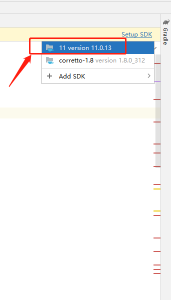

# MindSpore Dev ToolKit 源码编译指导

本文档介绍如何基于IntelliJ IDEA源码编译MindSpore Dev ToolKit项目。

## 背景介绍

* MindSpore Dev ToolKit是一个PyCharm插件，需使用IntelliJ IDEA开发。[IntelliJ IDEA](https://www.jetbrains.com/idea/download)与Pycharm均为JetBrains公司开发的IDE。
* MindSpore Dev ToolKit 基于JDK 11开发。 如果您不了解JDK，请访问[https://jdk.java.net/](https://jdk.java.net/)了解并学习JDK以及java的相关知识。
* MindSpore Dev ToolKit使用[Gradle](https://gradle.org)6.6.1构建，但无需提前安装。IntelliJ IDEA会自动根据代码使用"gradle wrapper"机制配置好所需的gradle。

## 依赖软件

* 确认安装[IntelliJ IDEA](https://www.jetbrains.com/idea/download)。
* 确认安装JDK 11版本。
  注：2021.3版本的IntelliJ IDEA自带一个名为jbr-11 JetBrains Runtime version 11.0.10的JDK，可以直接使用。
  
   

## 编译

1. 保证依赖软件均已成功配置。

2. 从代码仓下载[本项目](https://gitee.com/indspore/ide-plugin)源码。
   * 直接下载代码的zip包

      

   * 使用git下载

   ```
   git clone https://gitee.com/mindspore/ide-plugin.git
   ```

3. 使用IntelliJ IDEA打开项目。
   * File -> Open

      

   * 打开下载项目文件位置

      

   * 点击右下角弹窗中的load

      

4. 如果提示没有JDK，请选择一个JDK

   

   

6. 等待同步完成。

   

7. 构建项目。

   

8. 构建完成。

   

9. 构建完成后至项目目录下/build/distributions目录下获取插件安装包

   

## 更多
* 本项目构建基于IntelliJ Platform Plugin SDK之[Building Plugins with Gradle](https://plugins.jetbrains.com/docs/intellij/gradle-build-system.html)章节。如需了解调试等进阶功能，请阅读官方文档。