# MindSpore Dev Toolkit 快速入门指南

MindSpore Dev Toolkit作为Pycharm插件工具，为用户提供一键安装conda，创建conda环境，并使用conda创建MindSpore项目等功能。本文旨在帮助用户快速了解使用本产品。

## 一、系统需求

MindSpore Dev ToolKit 插件可支持[PyCharm](https://www.jetbrains.com/pycharm/)。PyCharm是一款多平台Python IDE。

* 插件支持的操作系统：

    * Windows 10
    * Linux

* 插件支持的PyCharm版本:

    * 2020.3
    * 2021.1
    * 2021.2
    * 2021.3

## 二、插件安装

1. 获取[插件Zip包](https://ms-release.obs.cn-north-4.myhuaweicloud.com/1.8.1/IdePlugin/any/MindSpore_Dev_ToolKit-1.8.1.zip)。
2. 启动Pycharm单击左上菜单栏，选择File->Settings->Plugins->Install Plugin from Disk。
   如图：

   

3. 选择插件zip包。

## 三、创建MindSpore项目

### 技术背景

本功能的实现基于[conda](https://conda.io)。Conda是一个包管理和环境管理系统，是MindSpore推荐的安装方式之一。

### 使用步骤

1. 选择File -> New Project。

   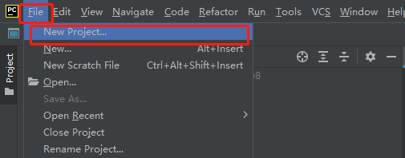

2. 选择MindSpore。

   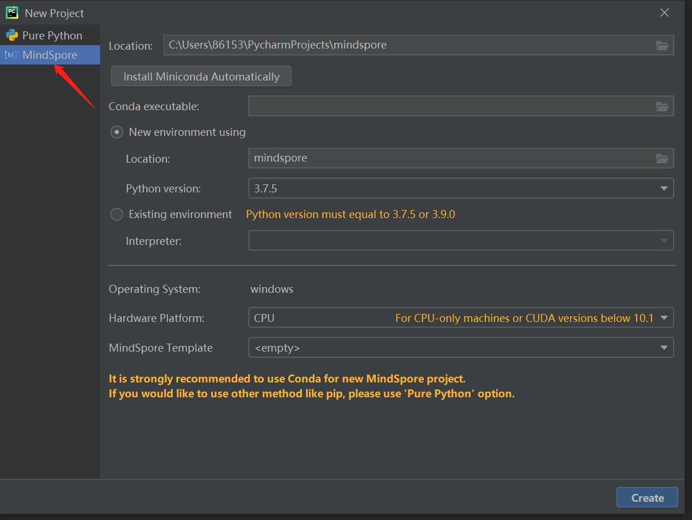

3. Miniconda下载安装。***已经安装过conda的可以跳过此步骤。***
   * 点击 Install Miniconda Automatically按钮。

      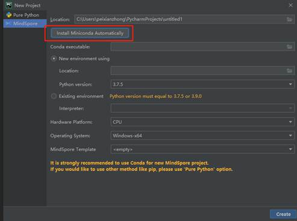

   * 选择下载安装文件夹。**建议不修改路径，使用默认路径安装conda。**

      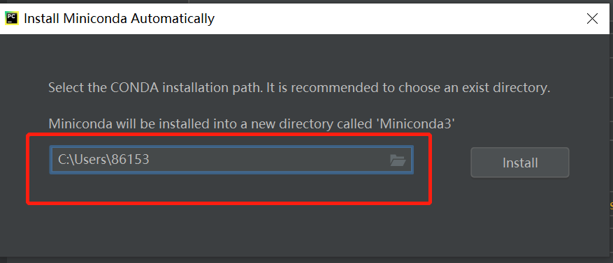

   * 点击Install按钮，等待下载安装。

      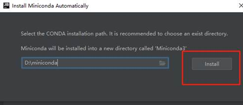

      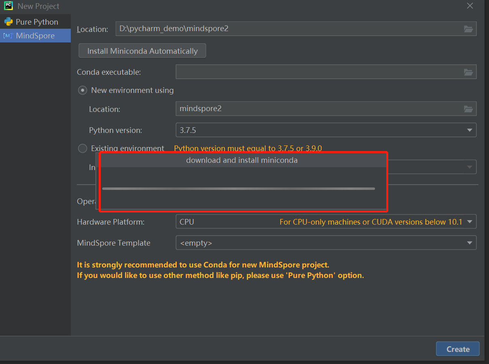

   * Miniconda下载安装完成。

      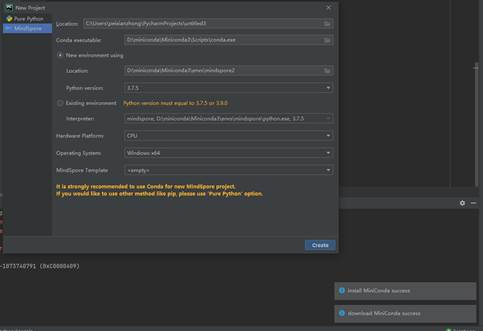

   * 根据提示重新启动PyCharm或者稍后自行重新启动PyCharm。

      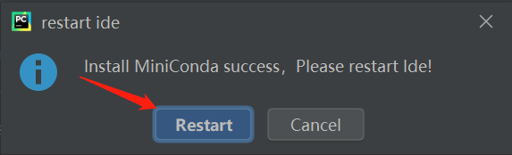

4. 如果Conda executable没有自动填充，选择已安装的conda的路径。

   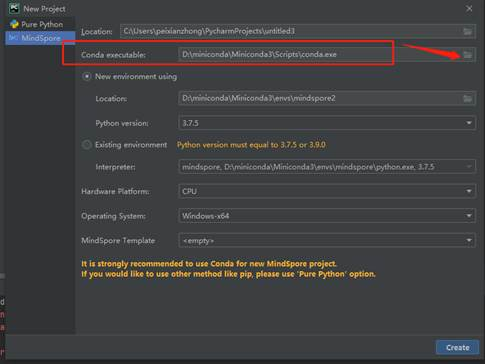

5. 创建或选择已有的conda环境。
   * 创建新的conda环境。 **建议不修改路径，使用默认路径创建conda环境。由于PyCharm限制，Linux系统下暂时无法选择默认目录以外的地址。**

      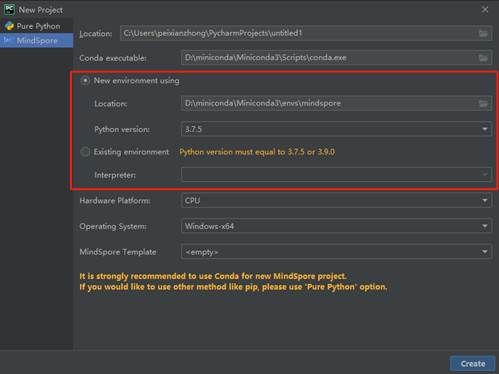

   * 选择PyCharm中已有的conda环境。

      

6. 选择硬件环境和MindSpore项目最佳实践模板。
   * 选择硬件环境。

      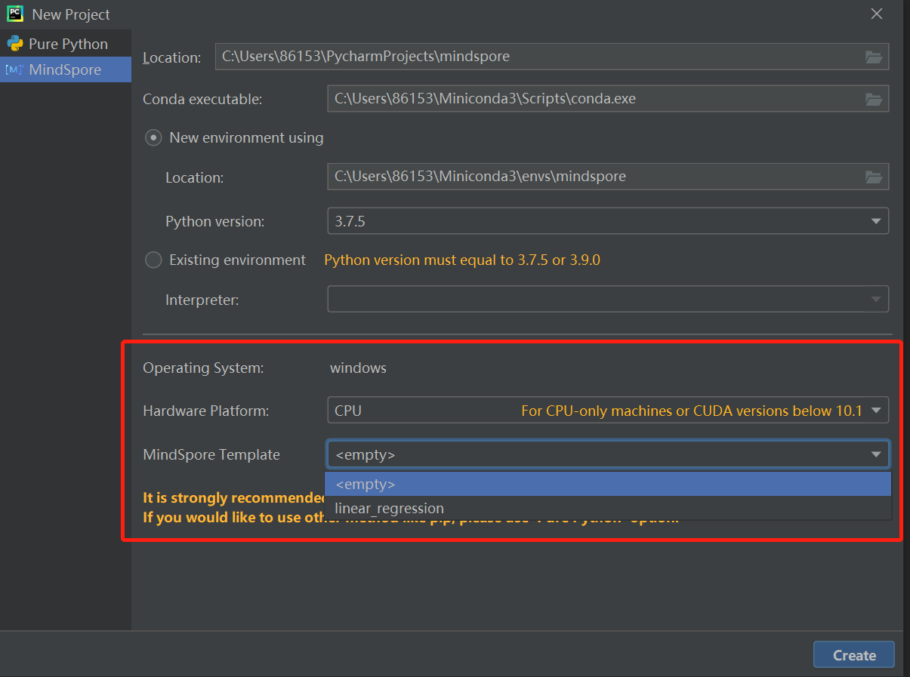

   * 选择最佳实践模板。最佳实践模版是MindSpore提供一些样例项目，以供新用户熟悉MindSpore。最佳实践模版可以直接运行。

      

7. 点击Create按钮新建项目，等待MindSpore下载安装成功。
   * 点击Create按钮创建MindSpore新项目。

      

   * 正在创建创建conda环境。

      

   * 正在通过conda配置MindSpore。

      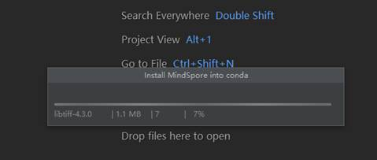

8. 创建MindSpore项目完成。

      

9. 验证MindSpore项目是否创建成功。
   * 点击下方Terminal，输入 python -c "import mindspore;mindspore.run_check()" ，查看输出。  如下图，显示了版本号等，表示MindSpore环境可用。

      

   * 如果选择了最佳实践模版，可以通过运行最佳实践，测试MindSpore环境。

      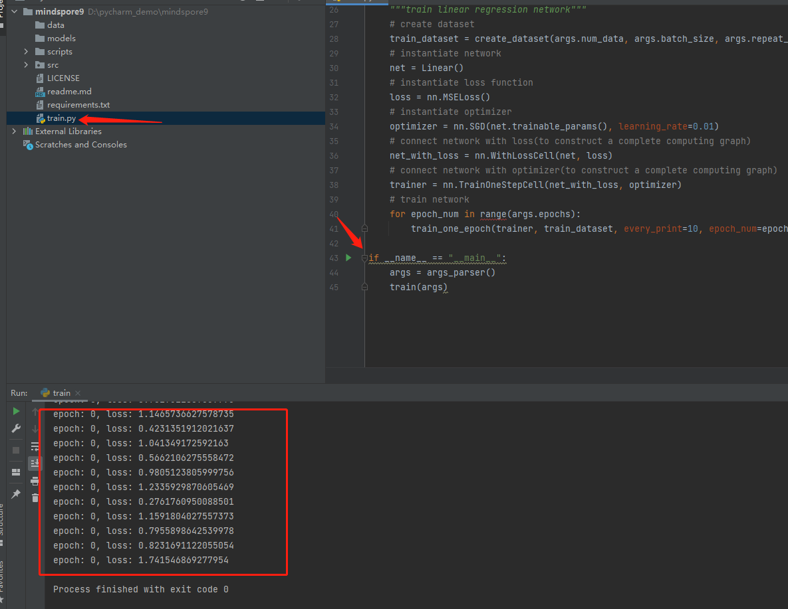

      

      

## 四、算子互搜

### 使用步骤

1. 双击shift弹出全局搜索页面。

      

2. 选择MindSpore。

      

3. 输入要搜索的PyTorch或TensorFlow的算子，获取与MindSpore算子的对应关系列表。

      

      

4. 点击列表中的条目，可以在右边侧边栏浏览对应条目的官网文档。

      

## 五、代码补全

### 使用步骤

1. 打开Python文件编写代码。

      

2. 编码时，补全会自动生效。有MindSpore图标的条目为MindSpore Dev Toolkit智能补全提供的代码。

      

      

## 六、文件级别算子扫描

### 使用步骤

1. 在当前文件任意位置处右键，打开菜单，点击菜单最上方的"operator scan"。
   
      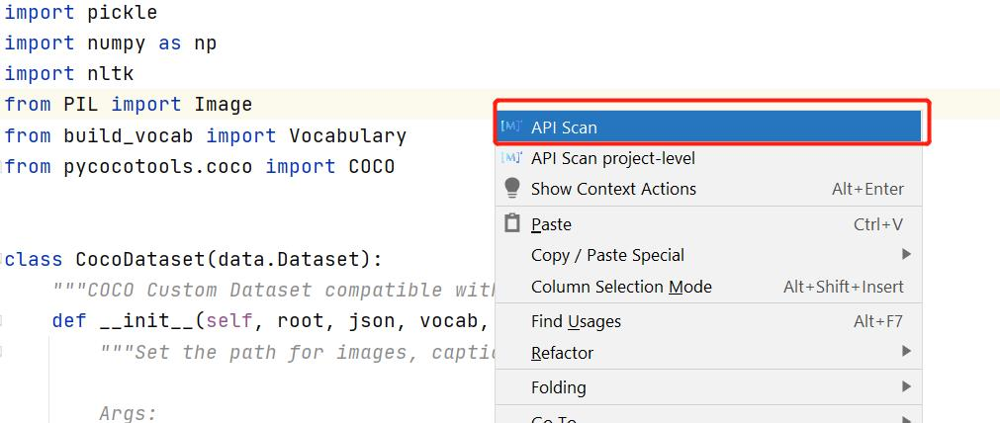

2. 右边栏会自动弹出，展示扫描出的算子，并展示包含名称，网址等信息的详细列表。若本文件中未扫描到算子，则不会弹出窗口。
  
      

3. 蓝色字体的部分均可以点击，会自动在上方再打开一栏，展示网页。
   
      
      
4. 点击右上角"导出"按钮，可将内容导出到csv表格。
   
      

## 七、项目级别算子扫描

### 使用步骤

1. 在当前文件任意位置处右键，打开菜单，点击菜单上方第二个"operator scan project-level"，或在上方工具栏选择"Tools"，再选择"operator scan project-level"。
   
      

      

2. 右边栏会弹出整个项目中扫描出的算子，并展示包含名称，网址等信息的详细列表。
   
      

3. 在上方框中可以选择单个文件，下方框中将单独展示此文件中的算子，文件选择可以随意切换。
   
      

      

4. 蓝色字体部分均可以点击，会自动在上方再打开一栏，展示网页。
   
      

5. 点击”导出“按钮，可将内容导出到csv表格。

      