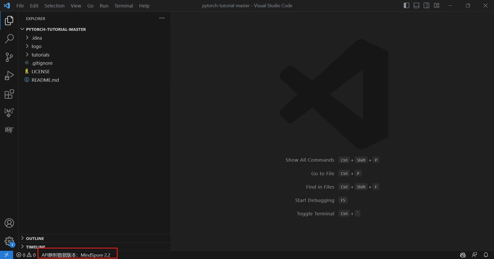
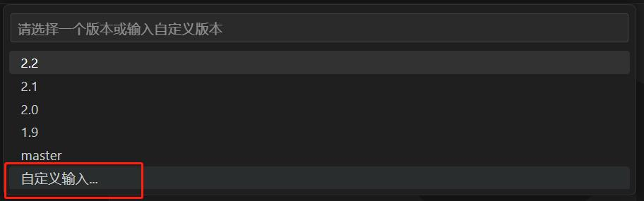
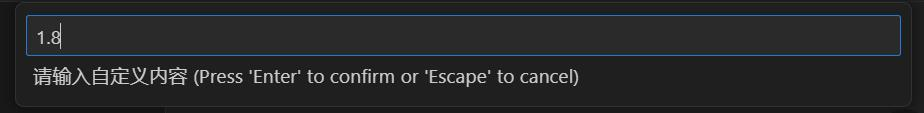
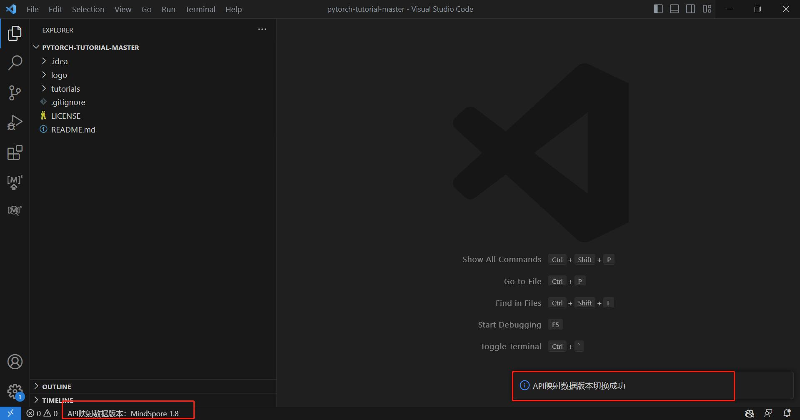
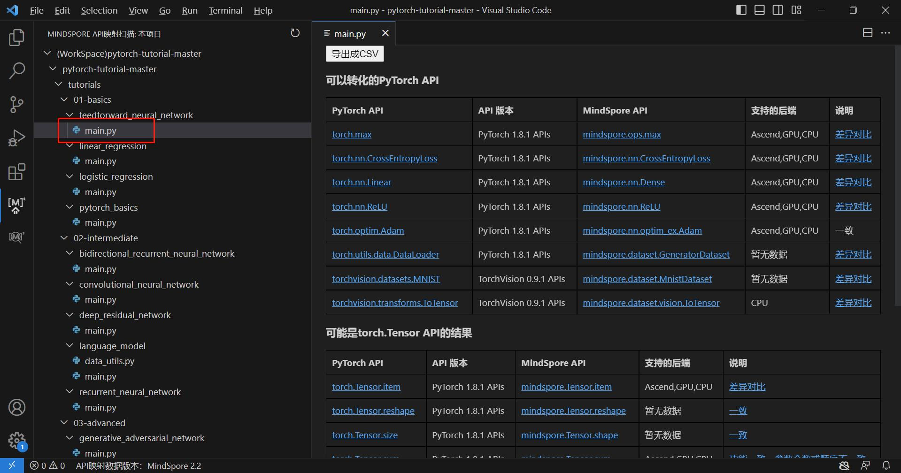
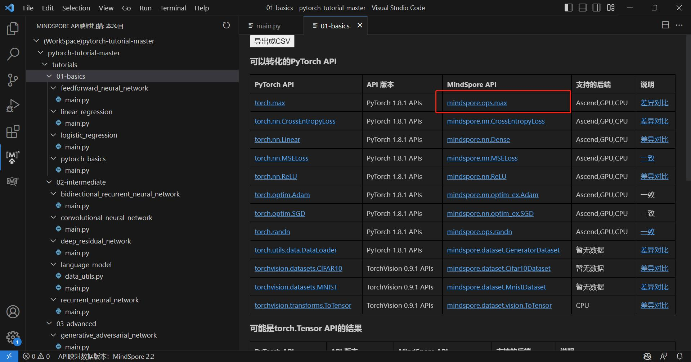
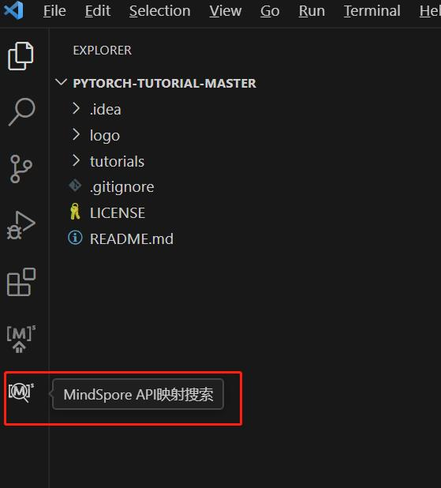
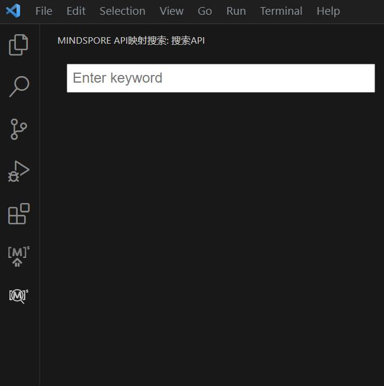
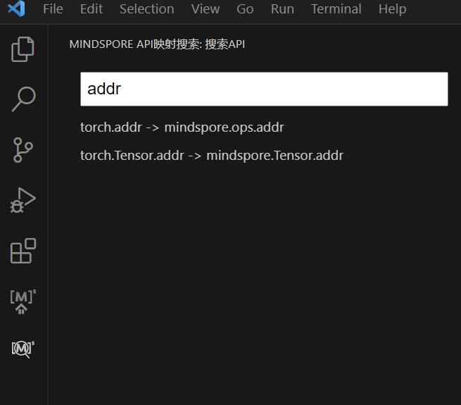

# MindSpore Dev Toolkit 快速入门指南

MindSpore Dev Toolkit作为Visual Studio Code插件工具，为用户提供代码补全功能。本文旨在帮助用户快速了解使用本产品。

## 一、系统需求

MindSpore Dev ToolKit 插件可支持[Visual Studio Code](https://code.visualstudio.com/)。
* 插件支持的操作系统：

   * Windows 10
   * Linux

## 二、插件安装

1. 获取[插件vsix包](https://ms-release.obs.cn-north-4.myhuaweicloud.com/2.1.0/IdePlugin/any/mindspore-dev-toolkit-2.1.0.vsix)。
2. 点击左侧第五个按钮“Extensions”，点击右上角三个点，再点击“Install from VSIX...”

   

3. 从文件夹中选择下载好的vsix文件，插件自动开始安装。右下角提示"Completed installing MindSpore Dev Toolkit extension from VSIX"，则插件安装成功。

   

4. 点击左边栏的刷新按钮，能看到”INSTALLED“目录中有”MindSpore Dev Toolkit"插件，至此插件安装成功。

   

## 三、代码补全

### 使用步骤

1. 第一次安装或使用插件时，会自动下载模型，右下角出现"开始下载Model"，"下载Model成功"提示则表示模型下载且启动成功。若网速较慢，模型需要花费十余分钟下载。下载完成后才会出现"下载Model成功"的字样。若非第一次使用，将不会出现提示。

   

2. 打开Python文件编写代码。

   

3. 编码时，补全会自动生效。有MindSpore Dev Toolkit后缀名称的为此插件智能补全提供的代码。

   

## 四、API映射搜索与扫描

### 简介

API 映射指PyTorch API与MindSpore API的映射关系。在MindSpore Dev Toolkit中，提供了API映射搜索和API映射扫描两大功能。且用户可以自由切换API映射文件的版本。

### API映射数据版本切换

1. 不同版本的API映射数据会导致不同的API映射扫描和API映射搜索结果，但不会影响环境中的MindSpore版本。默认版本与插件版本一致，版本信息会展示在左下角状态栏。

   

2. 点击此状态栏，页面上方会弹出下拉框，包含了默认可以切换的版本号选项。用户可以点击任意版本号切换版本，或者点击”自定义输入“的选项以后，在再次弹出的输入框中输入其他版本号切换版本。

   

3. 点击任意版本号，开始切换版本，左下角状态栏提示版本切换中的状态

   

4. 若想自定义输入版本号，在下拉框时点击“自定义输入”的选项，下拉框转变为输入框，按照2.1或2.1.0的格式输入版本号，按回车键开始切换版本，左下角状态栏提示切换中的状态

   

   

5. 若切换成功，右下角信息提示切换成功，左下角状态栏展示切换后的MindSpore版本信息。

   

6. 若切换失败，右下角信息提示切换失败，左下角状态栏展示切换前的MindSpore版本信息。版本号不存在、网络错误会导致切换失败，请排查后再次尝试。如需查看最新文档，可以切换到master版本。

   

7. 当自定义输入的版本号切换成功后，此版本号会加入到下拉框中展示。

   

### API映射扫描

#### 文件级API映射扫描

1. 在当前文件任意位置处右键，打开菜单，选择“扫描本地文件”。

   

2. 右边栏会弹出当前文件中扫描出的算子，包括“可以转化的PyTorch API”、“可能是torch.Tensor API的结果”、
   “暂未提供直接映射关系的PyTorch API”三种扫描结果列表。
   其中：

   - "可以转换的PyTorch API"指在文件中被使用的且可以转换为MindSpore API的PyTorch API
   - "可能是torch.Tensor API"指名字和torch.Tensor的API名字相同，可能是torch.Tensor的API且可以转换为MindSpore API的API
   - "暂未提供直接映射关系的PyTorch API"指虽然是PyTorch API或可能是torch.Tensor的API，但是暂时没有直接对应为MindSpore API的API

   

#### 项目级API映射扫描

1. 点击Visual Studio Code左侧边栏MindSpore Dev Toolkit图标。

   

2. 左边栏会生成当前IDE工程中仅含Python文件的工程树视图。

   

3. 若选择视图中单个Python文件，可获取该文件的算子扫描结果列表。

   

4. 若选择视图中文件目录，可获取该目录下所有Python文件的算子扫描结果列表。

   

5. 蓝色字体部分均可以点击，会自动在用户默认浏览器中打开网页

   

   

### API映射搜索

1. 点击Visual Studio Code左侧边栏API Search图标。

   

2. 左侧边栏会生成一个输入框。

   

3. 在输入框中输入任意单词，下方会展示出当前关键词的搜索结果，且搜索结果根据输入内容实时更新。

   

4. 点击任意搜索结果，会在用户默认浏览器中打开网页。

   

   
