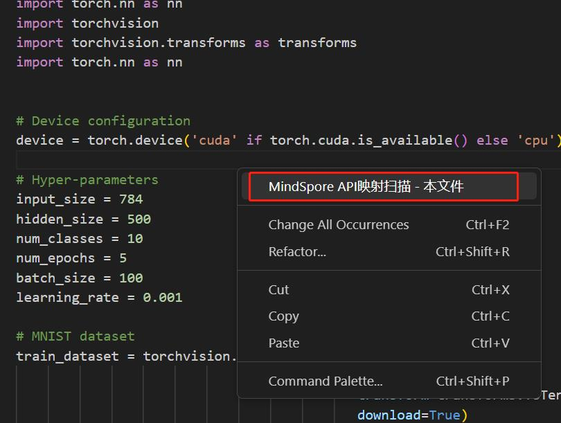
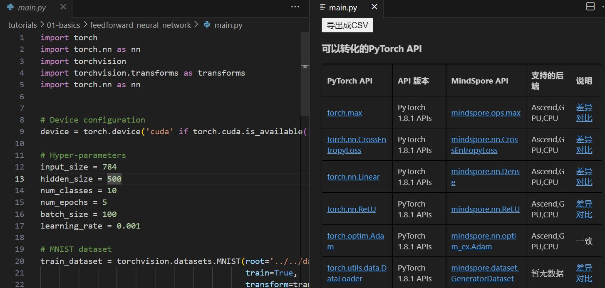

# MindSpore Dev Toolkit 快速入门指南

MindSpore Dev Toolkit作为Visual Studio Code插件工具，为用户提供代码补全功能。本文旨在帮助用户快速了解使用本产品。

## 一、系统需求

MindSpore Dev ToolKit 插件可支持[Visual Studio Code](https://code.visualstudio.com/)。
* 插件支持的操作系统：

   * Windows 10
   * Linux

## 二、插件安装

1. 获取[插件vsix包](https://ms-release.obs.cn-north-4.myhuaweicloud.com/2.0.0rc1/IdePlugin/any/mindspore-dev-toolkit-2.0.0.vsix)。
2. 点击左侧第五个按钮“Extensions”，点击右上角三个点，再点击“Install from VSIX...”

   

3. 从文件夹中选择下载好的vsix文件，插件自动开始安装。右下角提示"Completed installing MindSpore Dev Toolkit extension from VSIX"，则插件安装成功。

   

4. 点击左边栏的刷新按钮，能看到”INSTALLED“目录中有”MindSpore Dev Toolkit"插件，至此插件安装成功。

   

## 三、代码补全

### 使用步骤

1. 第一次安装或使用插件时，会自动下载模型，右下角出现"开始下载Model"，"下载Model成功"提示则表示模型下载且启动成功。若网速较慢，模型需要花费十余分钟下载。下载完成后才会出现"下载Model成功"的字样。若非第一次使用，将不会出现提示。

   

2. 打开Python文件编写代码。

   

3. 编码时，补全会自动生效。有MindSpore Dev Toolkit后缀名称的为此插件智能补全提供的代码。

   

## 四、torch.tensor接口分析

### 单文件分析

1. 在打开的python文件编辑界面点击右键，选择“扫描本地文件”。

   

2. 扫描后，生成该文件中torch.tensor接口使用分析结果，包括“可以转化的PyTorch API”、“可能是torch.Tensor API的结果”、
   “暂未提供直接映射关系的PyTorch API”三种分析结果。

   

### 多文件分析
1. 点击左侧边栏mindSpore Dev Toolkit图标。

   

2. 在左侧生成当前IDE工程中仅含python文件的工程树视图。

   

3. 若选中python文件，可获取该文件的接口分析结果。

   

4. 若选中文件目录，可获取该目录下所有python文件的接口分析结果。

   

