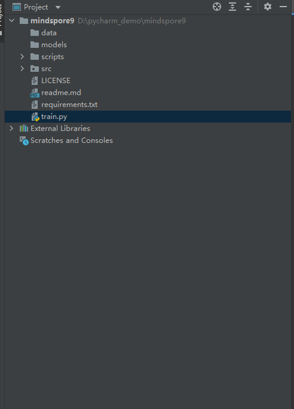

## MindSpore Dev Toolkit

MindSpore Dev Toolkit作为Pycharm插件工具，为用户提供一键安装conda，创建conda环境，并使用conda创建MindSpore项目等功能。

**前提条件：**

PC已安装2020.3及以上版本的Pycharm IDE。

**创建项目**

1. File -> New Project。

 

2. 点击MindSpore。

 

3. Miniconda下载安装。（已经安装过conda软件的用户直接看此步骤的第5步）

   1. 点击 Install Miniconda Automatically按钮。

   

   2. 选择下载安装文件夹。

   

   3. 点击Install按钮，等待下载。

   

   

   4. Miniconda下载安装完成。

   

   5. 自己选择已安装的conda路径。

   

 

4. 创建或选择已有的conda环境。 强烈建议在默认路路径下创建新的conda环境，即只改变末尾的文件夹名称。使用非默认的路径可能会导致安装失败。

 

5. 选择硬件环境、MindSpore模板。

 

6. 点击Create按钮新建项目，等待MindSpore下载安装成功。

 

7. 创建MindSpore项目完成。

 

8. 运行最佳实践。

