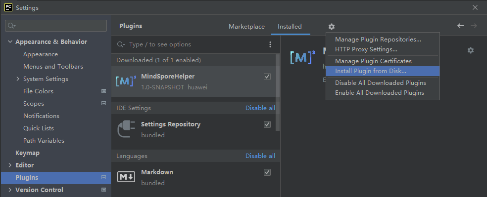

[](https://github.com/mindspore-ai/mindspore/blob/master/LICENSE)


<!-- TOC -->

- [MindSpore Dev Toolkit介绍](#mindspore-dev-toolkit-介绍)
    - [MindSpore运行管理](#MindSpore运行管理)
    - [对接智能知识搜索](#对接智能知识搜索)
    - [智能代码补全【TODO】](#智能代码补全【TODO】)
    - [算子互搜【TODO】](#算子互搜【TODO】)
- [构建](#构建)
    - [依赖](#依赖)
    - [安装](#安装)
    - [运行和调试](#运行和调试) 
- [快速入门](#快速入门)
- [文档](#文档)
- [社区](#社区)
    - [治理](#治理)
    - [交流](#交流)
- [贡献](#贡献)
- [版本说明](#版本说明)
- [许可证](#许可证)

<!-- /TOC -->

## MindSpore Dev ToolKit介绍

MindSpore Dev Toolkit是一款面向MindSpore开发者的开发套件。通过深度学习、智能搜索及智能推荐等技术，打造只能计算最佳体验，致力于全面提升MindSpore框架的易用性，助力MindSpore生态推广。 MindSpore Dev Toolkit提供如下功能：

### MindSpore运行管理
* 创建Conda环境或选择已有Conda环境，并安装MindSpore二进制包至Conda环境。
* 部署最佳实践模版。不仅可以测试环境是否安装成功，对新用户也提供了一个MindSpore的入门介绍。
* 在网络状况良好时，10分钟之内即可完成环境安装，开始体验MindSpore。最大可节约新用户80%的环境配置时间

### 对接智能知识搜索
* 定向推荐：根据用户使用习惯，提供更精准的搜索结果
* 沉浸式资料检索体检，避免在IDE和浏览器之间的互相切换。适配侧边栏，提供窄屏适配界面。

### 智能代码补全【TODO】
* 提供基于MindSpore项目的AI代码补全。
* 无需安装MindSpore环境，也可轻松开发MindSpore

### 算子互搜【TODO】
* 快速搜索MindSpore算子，在侧边栏直接展示算子详情
* 为方便其他机器学习框架用户，通过搜索其他主流框架算子，联想匹配对应MindSpore算子


## 构建

### 依赖

基本要求：

* Gradle（>=7.2)

* JDK(>=11)

运行 git clone命令下载代码，运行以下命令：

  ```
$ gradle buildPlugin
  ```

构建完成后，切换至build/distributions文件夹获取.zip格式压缩包。

### 安装

获取插件Zip包。

启动Pycharm单击左上菜单栏，选择File->Settings->Plugins->Install Plugin from Disk



选中构建产生的ZIP压缩包。


### 运行和调试

1.运行git clone命令下载代码

```
git clone https://gitee.com/mindspore/ide-plugin.git
```

2.在位于gradle的toolwindow，点击图标"Reload all Gradle Projects"

* reload 成功后，可以单击ide-plugin->Tasks->build->build,等待工程编译成功。

* 单击ide-plugin->Tasks->intellij->runIde,可以启动沙盒

3.现在您可以点击运行，方式为点击Run>Run(build/runIde) 或者run>Debug(安全模式)

## 快速入门

参考[快速入门](https://gitee.com/mindspore/ide-plugin/blob/master/MindSpore%20Dev%20Toolkit.md)。

## 社区

### 治理

查看MindSpore如何进行[开放治理](https://gitee.com/mindspore/community/blob/master/governance.md)。

### 交流

- [MindSpore Slack](https://join.slack.com/t/mindspore/shared_invite/zt-dgk65rli-3ex4xvS4wHX7UDmsQmfu8w) 开发者交流平台。
- `#mindspore`IRC频道（仅用于会议记录）
- 视频会议：待定
- 邮件列表：<https://mailweb.mindspore.cn/postorius/lists>

## 贡献

欢迎参与贡献。更多详情，请参阅我们的[贡献者Wiki](https://gitee.com/mindspore/mindspore/blob/master/CONTRIBUTING.md)。

## 版本说明

1.6BETA开源

## 许可证

[Apache License 2.0](https://gitee.com/mindspore/mindspore#/mindspore/mindspore/blob/master/LICENSE)
