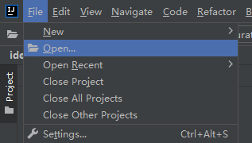
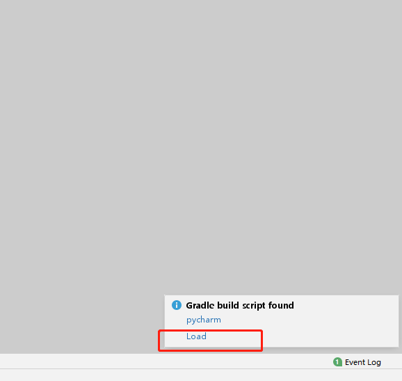
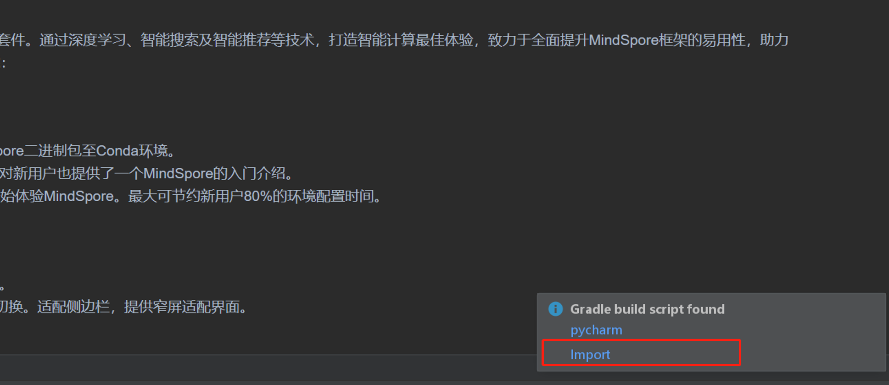
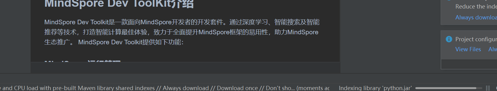
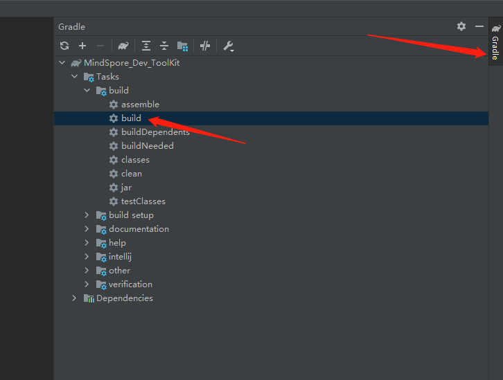
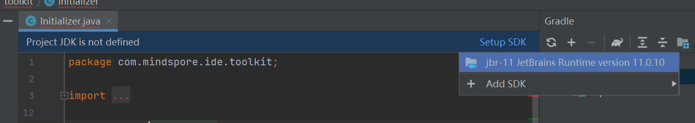

## 编译指导

1. [下载](https://www.jetbrains.com/idea/download) 安装Intellij IDEA。

2. 下载本开源项目。[项目地址](https://gitee.com/mindspore/ide-plugin)

3. IntelliJ IDEA打开项目。

  File -> Open

  

  打开下载项目文件位置

  

  点击右下角弹窗中的import

  

4. 等待同步完成。

  

5. 编译项目。

  

6. 编译完成。

  

## 备注

- 如果没有JDK环境，点击Setup SDK 选择java环境。建议使用JDK 11，也可以选择如下图的JetBrains Runtime。

  

- 本项目构建基于IntelliJ Platform Plugin SDK之[Building Plugins with Gradle](https://plugins.jetbrains.com/docs/intellij/gradle-build-system.html)章节。